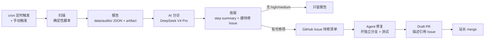

# 站点自迭代 Autopilot · 设计文档

目标：让 tuaran-home-page 在「作者永远是站长、AI 是助手」的边界内自我迭代。本系统由三个错峰定时扫描任务组成，扫描全自动，修复走分支 + Draft PR，merge 永远由站长人工完成。

## 三个定时任务

| 任务 | 频率 | 扫描范围 | 修复 PR 示例 | 分支前缀 |
| --- | --- | --- | --- | --- |
| security-scan | 每周一 09:17（北京） | npm audit 依赖漏洞、被 Git 跟踪的敏感文件、安全响应头静态检查 | 升级依赖、清理敏感文件、补 HSTS/CSP 配置 | `codex/security-scan-<日期>` |
| perf-scan | 每两周周三 09:17（北京，偶数 ISO 周；手动触发不受周次限制） | public/ 资源体积、超大源文件/内联数据、本地构建 chunk | 压缩图片、数据外移 JSON/R2、拆包、调缓存 | `codex/perf-scan-<日期>` |
| design-scan | 每月 1 日 09:17（北京） | Tailwind 透明度类与主题 token、img alt 可访问性启发式 | 修透明度类、补 alt、统一设计 token | `codex/design-scan-<日期>` |

错峰原因：三个任务共用同一仓库，同一天并发会抢分支、制造冲突。三个任务都支持 `workflow_dispatch` 手动触发。

## 统一流水线



设计原则：**扫描与修复分离**。扫描是纯确定性脚本，任何环境结果一致；修复由 Agent 依据报告和 Issue 执行。扫描只负责「发现问题并留痕」，不直接改代码。确定性扫描之上叠加一层大模型智能分诊，把「发现」升级为「判断」。

## AI 智能分诊（DeepSeek V4 Pro）

三个巡检在扫描后都会调用 DeepSeek V4 Pro 做智能分诊（`scripts/scan-analyze.mjs`）：

- **误报过滤**：识别已知有意为之的资源（大视频、内联数据）与启发式误报（如组件代理导致的 alt 误判）；
- **优先级排序**：按「修复性价比 × 风险」给值得修的项目排序；
- **修复方案**：为每个项目给出具体动作、PR 标题与建议分支名；
- **风险提示**：汇总跨项目风险与需要站长决策的议题。

模型通过 OpenAI 兼容协议调用，环境变量与线上一致：`DEEPSEEK_API_KEY`（必需，GitHub Actions 用仓库 Secret 配置）、`DEEPSEEK_BASE_URL`、`DEEPSEEK_MODEL`。

**模型路由规则：简单的任务用 `deepseek-v4-flash`，复杂的任务用 `deepseek-v4-pro`。** 判定依据：

- 安全分诊永远按复杂处理（误判成本高，涉及漏洞与权限边界）；
- 报告存在 high 发现、high+medium 达 3 项、或总发现达 8 项 → 复杂；
- 其余例行分诊（少量 low/info）→ 简单；
- `DEEPSEEK_MODEL` 显式配置时优先于规则；
- 简单任务被路由到 flash 但分析失败（空内容/解析失败）时，自动改用 pro 重试一次。

分诊结果写回报告文件的 `aiAnalysis` 字段，随 step summary 与待修 Issue 一起呈现。

脚本侧客户端见 `scripts/scan-deepseek.mjs`，与 `lib/deepseek.js` 保持同一协议契约（Edge 模块无法被普通 Node 加载，故按契约精简实现，不改生产代码）。JSON 输出模式失败（空内容/解析失败）时会自动改用普通文本模式重试一次；缺少 API Key 或最终失败时分析层自动降级（status=`skipped`/`failed`），扫描与 Issue 流程不受影响。

## 报告格式

报告写入 `data/audits/<type>-<YYYY-MM-DD>.json`（`/data/` 已被 `.gitignore` 忽略，不进 Git；workflow 同时把报告上传为 artifact）。schemaVersion 为 1，结构如下：

```json
{
  "schemaVersion": 1,
  "type": "security",
  "generatedAt": "2026-08-03T01:17:00.000Z",
  "runId": "123456789",
  "branch": "main",
  "summary": { "total": 3, "high": 1, "medium": 0, "low": 1, "info": 1 },
  "issues": [
    {
      "id": "sec-deps-lodash",
      "severity": "high",
      "title": "依赖漏洞：lodash（high）",
      "detail": "原型污染（CVE-…）",
      "evidence": ["npm audit --json", "range: <4.17.21"],
      "fix": {
        "kind": "dependency-bump",
        "suggestedBranch": "codex/security-scan-2026-08-03"
      },
      "tags": ["dependencies"]
    }
  ]
}
```

severity 四级：`high` / `medium` / `low` / `info`。只有 high/medium 会触发创建待修 Issue；low/info 只进报告，由站长决定是否处理。

## 待修清单 Issue 协议

`scripts/scan-handoff.mjs` 在存在 high/medium 发现时创建（或复用）标题为 `[autopilot] <type> 巡检 <日期>：N 个待处理项` 的 Issue。Issue 内嵌完整发现列表与修复协议。该 Issue 就是 Agent 的「任务单」：

- 每个主题一个分支，前缀 `codex/<type>-scan-<日期>`。
- 修复后运行相关测试与 `npm run build:check`。
- 开 Draft PR，描述引用对应 Issue；merge 由站长人工完成。
- 完成后在 Issue 勾选对应项；与巡检无关的改动一律不混入。

## 本地运行

```bash
node scripts/scan-security.mjs      # 安全巡检
node scripts/scan-performance.mjs   # 性能巡检
node scripts/scan-design.mjs        # 设计巡检
node scripts/scan-handoff.mjs security   # 本地只看摘要（不建 Issue）
```

本地运行时报告写入 `data/audits/`，摘要打印到终端；只有 `GITHUB_ACTIONS=true` 时 `scan-handoff.mjs` 才会创建 Issue。npm audit 需要网络，网络不可用时会记录为 info 级发现而不是中断扫描。

## 边界与铁律

- 扫描全自动，修复全自动到 Draft PR，**merge 永远人工**。
- Agent 不得自主发布内容、改变站点定位、修改付费/权益规则或架构正本；这类议题只允许在 Issue/规划中心提出，由站长决策。
- 一次扫描最多开少量 PR（默认不超过 3 个），严重问题优先，避免 PR 轰炸。
- 新增检查项必须先本地跑通、确认真实发现，再接入 workflow，防止噪音把信号淹没。
- 报告不进 Git，可追溯性依赖 artifact 与 Issue；若需要长期留档，后续把报告目录切到 `public/data/audits/` 或 `.agents/reports/` 并配套清理策略。

## 复用与新增资产

复用：`scripts/check-sensitive-files.mjs`（口径）、`scripts/check-public-asset-size.mjs`（口径）、`scripts/check-tailwind-opacity-classes.mjs`、`npm audit`、`build:check`、`git ls-files`、DeepSeek 统一协议（`lib/deepseek.js` 的契约）。

新增：`scripts/scan-utils.mjs`（共享）、`scripts/scan-security.mjs`、`scripts/scan-performance.mjs`、`scripts/scan-design.mjs`、`scripts/scan-deepseek.mjs`、`scripts/scan-analyze.mjs`、`scripts/scan-handoff.mjs`，以及三个 workflow。

## 第二阶段（后续迭代）

- 浏览器级性能指标：Lighthouse（LCP/CLS/INP）对首页、文章页、资源页跑分，需要真实站点与浏览器运行环境。
- 可访问性深度审计：axe-core 对主要页面扫描对比度、aria、焦点管理。
- 视觉回归：关键页面截图 + 基线对比，捕获移动端错位与样式漂移。
- 依赖更新交给 GitHub 原生 Dependabot 每周 PR，security-scan 专注代码逻辑与配置层面的问题，两者分工不重叠。
- 内容侧：调研自动起草、死链检测、SEO 审计按内容管线单独建任务，与本站三个工程巡检解耦。
