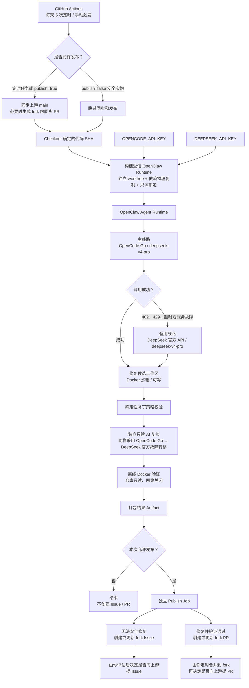

一套 AI 自动修复系统每天运行 5 次，直接模型费用可能只有每月 10—20 美元。这个数字看起来很低，却不能单独证明项目值得继续。

现有记录里有 6 次部署调试运行、2 次真正完成的 DeepSeek V4 Pro 调用，还没有产生一个正式合并的自动修复。现在可以核算成本基线，也可以设计试运行模型。最终 ROI 要等系统产生一批被接受和被拒绝的真实成果后再计算。

## 1、先给结论

- GitHub Actions 暂时不构成主要成本。目标仓库是公开仓库，使用标准 `ubuntu-24.04` runner，运行分钟按 GitHub 当前规则免费。
- 两次有效模型调用的估算费用约为 0.0168 美元和 0.094—0.099 美元。按每天 5 次推算，普通月份的模型用量大致落在 5—15 美元，修复和独立复审频繁时可能超过 20 美元。
- 当前运营产出为 0，建设期 ROI 为负。开发、调试和安全加固属于一次性投入，应该与稳定运行后的订阅、审核和维护费用分开记账。
- 最值得记录的指标是“每个被接受成果的总成本”。Token 数量只能解释模型账单，无法说明候选结果是否准确，也无法计算人工审核消耗。

## 2、自动修复链路

系统的目标链路可以压缩成 8 个步骤。

```text
每天 5 次定时触发
  → 同步上游提交、Bug Issue 和历史处理指纹
  → 检查上下文是否变化
  → DeepSeek V4 Pro 在隔离沙箱中巡检
  → 输出 no-action / issue-only / fix-ready
  → 对 fix-ready 做独立模型复审和确定性补丁验证
  → Docker 内运行聚焦测试
  → 在 fork 中生成 PR，等待人工审核
```



`no-action` 表示证据不足或没有可执行问题，只保留审计产物。`issue-only` 表示发现了值得记录的问题，但现有证据不足以安全修改。`fix-ready` 才会进入测试、复审和发布链路。

上游 Issue、标题、代码和提交信息都按不可信输入处理。模型在无网络、只读根文件系统、权限裁剪的 Docker 沙箱里运行，最多续跑 3 轮，每轮最多 15 分钟。repair 阶段使用只读 GitHub 权限，发布阶段单独授权。

这套权限拆分很重要。模型输出只是候选材料，发布权限只在验证完成后短暂出现。`issue-only` 和 `no-action` 还必须清空工作区与 Git index，避免前一轮残留修改混入后续结果。

方案材料列出的主要实现文件位于目标仓库：

- `.github/workflows/deepseek-autofix.yml`
- `scripts/deepseek-autofix.mjs`
- `scripts/deepseek-autofix/contracts.mjs`
- `.github/deepseek-autofix/agent-prompt.md`
- `.github/deepseek-autofix/review-prompt.md`

PR、Issue 和重复项都有数量上限，并使用指纹去重。安全链路已经搭起来，效果链路仍缺少正式合并样本。

## 3、两项直接现金成本

### GitHub Actions

GitHub 官方计费文档写明，公开仓库使用标准 GitHub-hosted runner 时，Actions 运行免费；larger runner 仍然收费。目标仓库使用标准 `ubuntu-24.04`，当前 runner 计算费用可以按 0 美元估算。

Artifact 保留 14 天，每次约 90 KB。每天 5 次对应的稳定存量约为 6—10 MB，远低于 GitHub Free 当前 500 MB 的 Artifact 与 Packages 共享额度。

这个结论有两个边界。仓库转为私有后，运行分钟要重新核算；Artifact 增长到免费额度以上时，存储会按 GB-hour 累积计费。

### OpenCode Go

OpenCode Go 当前价格为首月 5 美元，之后 10 美元/月。官方页面在 2026 年 8 月 3 日列出的 DeepSeek V4 Pro 价格是：

| 项目 | 每 100 万 tokens 价格 |
|---|---:|
| 输入 | $0.435 |
| 输出 | $0.87 |
| Cache Read | $0.003625 |

官方同时列出 Go 的 5 小时、每周和每月使用上限，并将 DeepSeek V4 Pro 的模型级包含用量估算标为 15 美元。达到 Go 上限后，如果 Zen 账户有余额并开启 `Use balance`，请求才会继续从 Zen 余额扣费。

最近一次调用返回 `402 Insufficient Balance`。现有信息只能确认 API Key 有效、付款方式已经绑定。可能原因包括 Go 订阅未激活、订阅额度尚未生效、Zen 余额为零，或达到限制后没有开启 `Use balance`。需要在 OpenCode 控制台核对订阅状态和当前用量，不能仅凭 402 锁定原因。

## 4、两次真实模型调用

已有两次成功完成的 V4 Pro 调用，可以作为运营成本的初始基线。

| 调用 | 工具调用 | 输入 | 输出 | Cache Read | 估算费用 |
|---|---:|---:|---:|---:|---:|
| 较短巡检 | 9 次 | 32,961 | 2,368 | 112,384 | $0.0168 |
| 深度巡检 | 36 次 | 188,979 | 7,626 | 1,501,440 | $0.094—0.099 |

按这两个样本，单次工作流可以先分为三档：

| 工作流结果 | 单次模型用量估算 |
|---|---:|
| 简单巡检或 no-action | 约 $0.02 |
| 正常深度巡检 | 约 $0.05—0.10 |
| 产生修复并触发独立复审 | 约 $0.10—0.20 |

每天 5 次、每月约 150 次，对应的模型用量估算如下。

| 月度场景 | 模型用量估算 |
|---|---:|
| 多数为快速 no-action | $2.5—5 |
| 按两次样本均值直接外推 | $8.33 |
| 每次平均约 $0.10 | $15 |
| 大量修复并触发独立复审 | $20—30 以上 |

这里的“模型用量”是按 token 单价换算的经济用量。实际现金支出还要看 Go 订阅是否正常覆盖、是否触发 Zen 余额扣费。使用 Go 且没有超额时，现金账更接近固定订阅费；使用量账仍适合比较不同运行策略。

两个样本只能说明数量级。仓库规模、上游变化、问题复杂度、工具调用次数和复审频率都会改变结果。

## 5、ROI 要分成两套账

建设期已经投入了方案设计、脚本开发、权限拆分、Docker 沙箱、调试和失败重跑。同期没有正式合并成果，建设 ROI 当前为负。

长期运营不能一直背着一次性建设成本。建议从系统稳定运行之日另开一套账。

```text
建设总成本 =
  设计时间 + 开发时间 + 调试时间 + 安全加固时间
```

```text
月度运营总成本 =
  OpenCode 固定订阅
  + Zen 超额费用
  + 人工审核时间 × 人工小时成本
  + 自动化维护时间 × 人工小时成本
```

```text
月度总收益 =
  合并修复数 × 每个修复节省的开发时间 × 人工小时价值
  + 有效 Issue 数 × Issue 发现价值
  + 提前避免故障的预期损失
```

```text
ROI = （月度总收益 - 月度运营总成本）÷ 月度运营总成本
```

Issue 发现了问题，但没有完成修复，可以按 0.25—0.5 个合并修复折算。折算权重需要在试运行开始前固定，避免月底看到结果后再改口径。

更实用的指标是：

```text
每个被接受成果的总成本 =
（月度订阅与超额费用 + 审核成本 + 维护成本）
÷（合并 PR 数 + Issue 折算数）
```

## 6、审核成本会迅速超过模型成本

假设每月触发 150 次，产生 15 个候选结果，其中 6 个被接受。每个候选审核 10 分钟，人工时间按 50 美元/小时计价，每个有效成果平均节省 1.5 小时，模型与订阅的合计现金支出按 15 美元估算。

```text
审核成本：15 × 10 分钟 × $50/小时 = $125
模型与订阅：$15
总成本：$140

收益：6 × 1.5 小时 × $50 = $450
ROI：($450 - $140) ÷ $140 ≈ 221%
```

如果 15 个候选里只有 2 个有效：

```text
收益：2 × 1.5 小时 × $50 = $150
ROI：($150 - $140) ÷ $140 ≈ 7%
```

模型账单没有变化，ROI 从 221% 降到约 7%。决定结果的是候选准确率、审核时间、最终接受率，以及每个成果实际节省的开发时间。

“节省 1.5 小时”也需要人工确认。简单依赖升级、测试补全和边界条件修复的节省时间差异很大，建议在合并时由审核者给出 `0.5 / 1 / 2 / 4+ 小时`四档估算。

## 7、减少没有新信号的调用

一天触发 5 次可以保留。模型调用应该由上下文变化决定。

```text
上游 SHA + Bug Issue 更新时间 + 已处理指纹
                    ↓
               上下文哈希
                    ↓
         哈希未变化 → 跳过模型
```

目标架构已经包含“上下文是否变化”的判断。当前实施清单没有单独证明这一步已经稳定生效，因此 30 天试运行应把 `context_changed` 和 `model_skipped` 写入审计结果。这样可以直接计算跳过率，也能发现哈希粒度过粗或过细的问题。

第二项优化是模型分层。DeepSeek V4 Flash 当前输入和输出单价大约是 Pro 的三分之一，可以负责低成本筛选；V4 Pro 只处理高价值候选、代码修改和独立复审。

分层不能降低发布门槛。Flash 的判断只决定是否升级到 Pro，最终 `fix-ready` 仍要经过 Pro 修复、独立复审、确定性补丁验证和 Docker 测试。

## 8、30 天试运行记录

每次触发至少写入一条结构化记录，月底才能自动汇总。

```json
{
  "triggered_at": "2026-08-03T12:53:00+08:00",
  "context_changed": true,
  "model_skipped": false,
  "result": "no-action",
  "model_cost_usd": 0.021,
  "review_minutes": 0,
  "accepted": false,
  "estimated_hours_saved": 0,
  "duplicate": false,
  "security_blocks": 0
}
```

30 天后汇总以下指标：

| 指标 | 计算口径 |
|---|---|
| 工作流成功率 | 成功结束次数 ÷ 总触发次数 |
| 模型跳过率 | `model_skipped=true` 次数 ÷ 总触发次数 |
| no-action 比例 | no-action 次数 ÷ 实际模型调用次数 |
| 假阳性率 | 被确认无效的候选数 ÷ 全部候选数 |
| PR 合并率 | 合并 PR 数 ÷ fix-ready PR 数 |
| 平均审核时间 | 审核总分钟数 ÷ 候选数 |
| 单位成果成本 | 月度运营总成本 ÷ 加权接受成果数 |
| 重复问题率 | 重复候选数 ÷ 全部候选数 |

建议继续投入的门槛是：

- 工作流成功率不低于 95%；
- 假阳性率不高于 25%；
- 平均审核时间不超过 15 分钟；
- 每月至少 2 个被接受成果；
- 每个被接受成果的总成本不超过对应人工成本的 25%；
- 没有越权发布、Secret 泄漏或未验证代码进入 PR。

连续 30 天达不到门槛，可以降低定时频率、让 Flash 负责初筛，或只在上游发生变化时触发。

## 9、当前状态

目前最准确的状态是“安全链路基本完成，商业效果尚未验证”。正常运行时，模型直接费用大概率处于每月 10—20 美元的数量级。人工审核成本很可能更高。

只要正式合并样本仍为 0，最终 ROI 就没有可解释性。现有数据只能用于界定最坏成本，以及建立可汇总、可复核的记录口径。

## 10、信息来源与未能验证

- [GitHub Actions 计费说明](https://docs.github.com/en/billing/concepts/product-billing/github-actions)：公开仓库标准 runner、Artifact 免费额度与超额存储计费规则，访问于 2026-08-03。
- [OpenCode Go 官方计费说明](https://opencode.ai/docs/go/)：订阅价格、使用上限、DeepSeek V4 Pro / Flash 价格和 `Use balance` 机制，访问于 2026-08-03。
- 工作流时间、沙箱策略、6 次调试运行、两次 token 记录和 402 状态来自项目运行材料，未通过 OpenCode 控制台账单或目标仓库 Actions 记录独立复核。
- 当前内容仓库没有方案材料所列的 `deepseek-autofix` 工作流与脚本，无法在本地确认实现细节、运行次数和发布权限配置。
- 0.10—0.20 美元的复审场景、Issue 的 0.25—0.5 折算权重、50 美元人工时薪和每个成果节省 1.5 小时均为试运行假设。
- 价格、模型目录和 Go 使用上限会变化，正式月报应保存当月官方价格快照。
