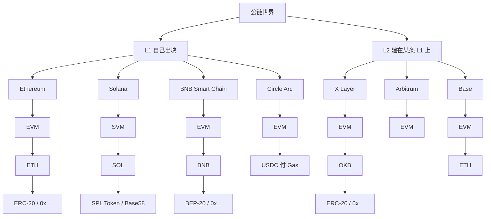
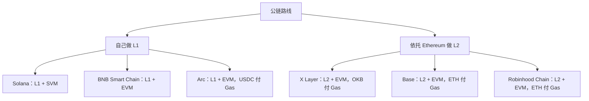

> **风险与合规提示：** 资料整理用于理解公链分层、虚拟机和代币标准，不构成投资、开户、发币、上架或法律建议。迷因币和平台币价格可以在短时间内归零；私钥丢失、钓鱼授权、合约漏洞、桥和排序器故障都可能导致全部本金损失。中国人民银行等八部门《银发〔2026〕42 号》把境内代币发行融资等虚拟货币相关业务列为非法金融活动；境外单位和个人不得以任何形式非法向境内主体提供交易、兑换、中介、定价等服务。违背公序良俗的相关民事法律行为无效，损失自行承担。

## 一、先给结论

**一枚币运行在一条具体的账本上。** 账本自己出块，叫 Layer 1；账本把执行放到另一层、把安全锚回某条 L1，叫 Layer 2。智能合约怎么跑，取决于虚拟机。链上资产怎么被钱包和交易所认出来，取决于 Token 标准。价格从哪里来，取决于有没有人愿意和它对盘。

这五层拆开以后，常见对象会落到同一棵树上：



可核验的要点：

1. **币和链要分开。** SOL 是 [Solana](/articles/research/topics/crypto-solana) 的原生代币；BNB 是 [BNB Chain](/articles/research/topics/crypto-binancecoin) 的原生代币；OKB 是欧易平台币，也是 X Layer 的 Gas；STARLINK 是 X Layer 上的一枚 ERC-20，合约地址 `0x87359b7d78b03bd81b567bf425263b453c73eeee`。
2. **L1 / L2 回答的是：这条链在基础设施里处于哪一层。** Ethereum、Solana、BNB Smart Chain、Arc 是 L1。X Layer、Base、Arbitrum 是以太坊 L2。
3. **虚拟机回答的是：智能合约怎么执行。** 地址以 `0x` 开头，多半是 EVM 账本；Solana 那种长 Base58 字符串，对应 SVM / Solana 账户。
4. **发币通常是调用这条链已有的 Token 标准。** Ethereum / X Layer / Base / Arc 上常见 ERC-20；BNB Smart Chain 上是几乎同一套接口的 BEP-20；Solana 上是 SPL Token 的 Mint。
5. **创建 Token 和做成市场，规模不同。** 前者是一次部署或一次 Mint；后者要流动性、成交、持有人和入口。对大陆读者：拆协议可以跟进；参与发币、兑换、开户按 42 号文不跟进。

## 二、事实层

### 1. 为什么问题会缠在一起

公开资料里，同一串字母经常同时当币名、链名和叙事名。

| 你看见的名字 | 它实际是什么 | 它所在的账本 | 原生 Gas / 记账单位 |
|---|---|---|---|
| SOL | 原生代币 | Solana（L1） | SOL |
| Solana | 独立公链 | 自己 | SOL |
| BNB | 平台币 + 链上 Gas | BNB Smart Chain（L1）等 | BNB |
| BNB Chain | 币安系公链品牌，核心执行链是 BNB Smart Chain | 自己出块；另有 opBNB 作为它的 L2 | BNB |
| OKB | 欧易平台币，也是 X Layer 唯一 Gas | X Layer（以太坊 L2） | OKB |
| X Layer | 欧易做的以太坊 L2 | 锚定 Ethereum | OKB |
| STARLINK / starlink cat | X Layer 上的 ERC-20 | X Layer | 转它要付 OKB |
| ETH | Ethereum 原生代币 | Ethereum（L1）；多数以太坊 L2 也用它付 Gas | ETH |
| USDC | Circle 发行的美元稳定币 | 多链部署；在 Arc 上同时是原生 Gas | 视链而定 |
| Arc | Circle 2026-09-16 上线的金融型 L1 | 自己 | USDC |

STARLINK 这个例子特别容易把人绕进去。OKLink 把 `0x87359b7d78b03bd81b567bf425263b453c73eeee` 登记为 X Layer 上的 ERC-20，显示名为 starlink cat。SpaceX 的 Starlink 是卫星互联网业务。两者共用一个公众熟悉的词，法律主体、资产和现金流都不自动相连。同名迷因在以太坊、Solana 上还有别的合约，例如以太坊上的 STARL（`0x8e6cd950ad6ba651f6dd608dc70e5886b1aa6b24`）和 Solana 上另有 mint，不能和 X Layer 这一枚互换。

### 2. 各条链公开把自己写成什么

| 网络 | 官方口径 | 虚拟机 | Chain ID（主网） | Gas | Token 标准 |
|---|---|---|---|---|---|
| Ethereum | L1；扩容路线以 Rollup 为中心 | EVM | 1 | ETH | [EIP-20 / ERC-20](https://eips.ethereum.org/EIPS/eip-20) |
| Solana | 独立 L1 | SVM（并行 runtime；程序多编译到 BPF） | — | SOL | [SPL Token / Mint](https://solana.com/docs/tokens) |
| BNB Smart Chain | 自主权、EVM 兼容 L1 | EVM | 56 | BNB | [BEP-20](https://github.com/bnb-chain/BEPs/blob/master/BEPs/BEP20.md) |
| X Layer | 欧易在增强 OP Stack 上做的以太坊 L2 | EVM-equivalent | 196（`0xC4`） | OKB，公告称供给固定 2100 万 | ERC-20 |
| Base | Coinbase 孵化的以太坊 L2，早期基于 OP Stack | EVM | 8453 | ETH | ERC-20 |
| Arc | Circle 2026-09-16 宣布的公开 L1 | EVM 兼容 | 开发者接入口径 5042 | 原生 USDC | ERC-20；原生 USDC 另有预置 ERC-20 接口 |

X Layer 的路径本身也说明「L2」不是一个冻结的产品名。2023 年欧易与 Polygon 合作，按 zkEVM / Polygon CDK 启动；2025-08-05 完成官方所称 PP 升级；现行开发者文档写成「enhanced Optimism Stack」，虚拟机 EVM-equivalent，排序器由 `op-node` 与 `op-reth` 协作，Gas 为 OKB。[网络信息页](https://web3.okx.com/xlayer/docs/developer/build-on-xlayer/network-information) 同时写 7 天挑战期，以及经 AggLayer 提交证明回 L1。

欧易对 OKTChain 的处理更直接。2025-08-13 公告写：OKTChain 与 X Layer 高度重叠，将逐步停止维护；OKX 交易所于当日 14:10（UTC+8）停 OKT 交易；OKTChain 维持出块至 2026-01-01。平台币口径收到 OKB，链口径收到 X Layer。

### 3. 地址为什么长得像

ethereum.org 账户页写明：外部账户地址取公钥 Keccak-256 哈希的**后 20 字节**，再加 `0x` 前缀，共 42 个字符。合约地址也是 42 位十六进制，由创建者地址与 nonce（或 `CREATE2` 的 salt 与代码哈希）派生。

EVM 兼容链复用这套账户模型。所以 X Layer、BNB Smart Chain、Base、Arc 上的地址都是 `0x...`。同一把私钥在这些链上会算出**同一个地址字符串**，余额却记在各自账本里。转错链、看错浏览器，资产不会自动出现在另一条链上。

Solana 用 Ed25519，账户是 32 字节公钥，显示成 Base58。代币不靠「每币一份独立 ERC-20 合约」来识别，而靠 Token Program 拥有的 **Mint 账户地址**。钱包持有某代币时，还要有对应的 Token Account，常见的是由钱包地址、Mint、Token Program 派生的 Associated Token Account。

### 4. 「发币」在规范里指什么

| 标准 | 文本 | 实际动作 | 钱包看见什么 |
|---|---|---|---|
| ERC-20 | EIP-20，2015-11-19 | 部署一份实现 `transfer` / `approve` / `balanceOf` 等接口的合约 | 合约地址 |
| BEP-20 | [BEP20.md](https://github.com/bnb-chain/BEPs/blob/master/BEPs/BEP20.md) | 在 BSC 上部署同类合约；规范写明由 ERC-20 导出，并补跨 Beacon Chain 的字段 | 同样是 `0x` 合约地址 |
| SPL Token | Solana Program Library | 不部署一份新的转账逻辑；对已部署的 Token Program 创建 Mint | Mint 地址 |

BEP-20 把 ERC-20 里可选的 `name` / `symbol` / `decimals` 写成必填，以便和 BNB Beacon Chain 互转。对用户来说，MetaMask 加 BSC 之后，操作手感和以太坊非常接近。这是「EVM 兼容」的产品后果：开发工具、浏览器插件、DEX 路由可以复用。

Solana 官方的 EVM→SVM 对照页写得更硬：以太坊用合约地址标识一枚代币；Solana 用 Mint 地址。创建 SPL 代币可以是一次 RPC，不必再编译一份 Solidity。

发射台把这件事做成流水线。[Pump.fun](/articles/research/topics/pump-fun) 在 Solana 上把创建 Mint、绑定曲线定价和早期交易收成同一条路径。X Layer、BSC 上也有各自的发射台和 DEX。技术动作仍是「按该链标准登记一枚新资产」。

### 5. 时间线：交易所和稳定币公司怎么选层

| 时间 | 事件 | 和分层有什么关系 |
|---|---|---|
| 2015-07-30 | Ethereum 主网 Frontier | 可编程 L1，EVM 成为后续兼容对象 |
| 2015-11-19 | EIP-20 | 同质代币有了钱包和 DEX 都能认的接口 |
| 2017 | BNB 作为以太坊 ERC-20 发行 | 先有交易所代币，后有自己的链 |
| 2019-04 | BNB 迁到自建 Binance Chain | 开始离开以太坊 L1 结算 |
| 2020-03-16 | Solana 主网 genesis | 独立 L1 + 非 EVM 执行环境 |
| 2020-09 | BSC 主网 | 自己做 L1，同时兼容 EVM |
| 2022-02 | BSC 更名为 BNB Chain | 品牌收到「一条生态」；执行层仍是 EVM L1 |
| 2022-08 前后 | Coinbase 公布 Base，基于 OP Stack | 交易所选以太坊 L2，Gas 继续用 ETH，不另发网络币 |
| 2023 | X Layer 以 zkEVM / Polygon CDK 启动 | 欧易把 OKB 做成 L2 Gas，接入以太坊安全模型 |
| 2024 | BNB Chain 侧的 opBNB | 币安在自有 L1 之上再做 L2 |
| 2025-08-13 | 欧易公告停维护 OKTChain、OKB 专用于 X Layer Gas | 放弃自有 Cosmos SDK L1，收口到以太坊 L2 |
| 2026-07-01 | [Robinhood Chain](/articles/research/topics/robinhood-chain) 主网 | 券商走 Arbitrum Nitro L2，Gas 用 ETH |
| 2026-09-16 | Circle 宣布 Arc 主网 | 稳定币公司自建金融型 L1，Gas 用 USDC |

## 三、结构分析

以后碰到新项目，可以按这一次序问。每一层只回答一个问题。

### 第一层：它是币，还是链？

| 币 | 链 |
|---|---|
| SOL | Solana |
| ETH | Ethereum |
| BNB | BNB Smart Chain / BNB Chain |
| OKB | X Layer（Gas）；欧易账户里它仍是平台权益 |
| USDC | 多链资产；在 Arc 上还承担原生 Gas |
| STARLINK | 没有自己的链，寄居在 X Layer |

原生代币付这一条链的手续费、常用于质押或验证者激励。ERC-20 / BEP-20 / SPL 是账本上的登记资产，转它们仍要付**该链的 Gas**。STARLINK 再热，转账消耗的也是 OKB，不会让 X Layer 改名。

### 第二层：这条链是 L1 还是 L2？

ethereum.org 把 Layer 2 写成：单独一条链，扩展以太坊，并继承以太坊的安全保证。主流形态是 Rollup：在 L2 执行，把数据或证明提交回 L1。Optimistic rollup 默认交易有效、用欺诈证明挑战；ZK rollup 提交有效性证明。

```text
L1
├─ Ethereum
├─ Solana
├─ BNB Smart Chain
└─ Arc

L2（均锚定 Ethereum）
├─ Base
├─ Arbitrum
├─ X Layer
└─ Robinhood Chain
```

L2 省的是执行成本。结算和数据可用性仍落在以太坊上。用户在 X Layer 上点确认，排序器先出 L2 块；要按官方文档理解的最终安全，仍要回到以太坊上的桥、证明或挑战期。X Layer 文档写 L2 出块约 1 秒，并列出 7 天挑战期这一 optimistic 模型里的常见参数。

侧链、Validium、独立 L1 都会在营销里自称「高性能链」。只有把数据可用性和争议解决绑回某条 L1 时，ethereum.org 才把它算进 Layer 2。BNB Smart Chain 官方写 self-sovereign，安全来自自己选出的验证者，所以它是 L1。

### 第三层：它用什么虚拟机？

EVM 是以太坊的状态转换函数：给定旧状态和一组交易，所有合规节点算出同一个新状态。ethereum.org 把它写成在所有节点上一致、安全执行字节码的虚拟环境，用 gas 计量计算量。

SVM 是对 Solana 执行环境的常用叫法：程序（合约）作为账户存在，运行时按账户访问并行调度。开发语言以 Rust 为主，账户模型和费用市场都与 EVM 不同。

```text
EVM
├─ Ethereum
├─ BNB Smart Chain
├─ X Layer
├─ Base
├─ Arbitrum
├─ Robinhood Chain
└─ Arc

SVM
└─ Solana
```

所以：

- 看见 `0x` 加 40 位十六进制 → 先按 EVM 链处理，再用 Chain ID 区分是 ETH、BSC、X Layer 还是 Arc。
- 看见一长串 Base58 → 先按 Solana / SVM 处理，再用 Mint 而不是「合约地址」去认代币。

EVM 兼容的收益很具体：Solidity、Remix、Hardhat、Foundry、MetaMask、常见 DEX 路由可以搬家。代价是：性能上限、费用模型和 MEV 结构会跟着 EVM 的账户与 gas 设计走。Solana 选择另一套执行环境，换吞吐和并行，也换走了「同一套以太坊工具直接部署」。

### 第四层：链上发行了什么 Token？

到这一层，才进入「发币」。

```text
X Layer  → ERC-20 → STARLINK → 0x8735...eeee
BSC      → BEP-20 → 各类迷因与应用币 → 0x...
Solana   → SPL Mint → Pump.fun 等发射台产出 → Mint 地址
Ethereum → ERC-20 → 稳定币、治理币、迷因 → 0x...
Arc      → 原生 USDC + ERC-20 → 支付和代币化资产
```

「难不难」取决于问的是哪一步。

部署一份标准 ERC-20 / BEP-20，或创建一枚 SPL Mint，公开工具已经把步骤写成向导。Gas 在 L2 和 Solana 上通常很低。难的是：代码有没有增发后门、所有权有没有放弃、交易税和黑名单、流动性会不会被撤、名字有没有撞上别人的商标和已有合约。

规范保证的是**接口能被钱包调用**。规范不保证这枚币有价值，也不保证名字所指的公司、卫星或猫咪与合约有任何法律关系。

### 第五层：谁让这个币有市场？

```text
登记 Token
    → 建交易对 / 注入流动性
    → DEX 成交
    → 持有人分布
    → 钱包、发射台、行情页曝光
    → 中心化交易所现货或 Alpha 类入口
```

第五层才碰到 [交易所](/articles/research/topics/cryptocurrency-exchanges) 和 [DApp](/articles/research/topics/dapp)。Uniswap 类 AMM 认的是标准接口加流动性池；中心化交易所认的是自己的上架、托管和撮合规则。OKX Wallet、Coinbase、币安 App 是流量入口，不是链本身。

欧易同时经营托管交易所和自托管 [OKX Wallet](/articles/research/topics/okx-web3-wallet)。Coinbase 同时经营持牌交易所和 Base。币安同时经营全球成交量最大的综合盘和 BNB Chain。入口可以把用户送到某条链；链上那枚 Token 仍按第四层的合约或 Mint 存在。

## 四、为什么各家路线不同

公链路线先分叉一次，再分叉一次：



**选择一：自己做 L1，还是做以太坊 L2？**

自己做 L1，得到出块规则、验证者集合、费用市场和品牌。也必须自己养安全预算。Solana、BSC、Arc 走这条。以太坊 L2 复用以太坊的结算和数据可用性，换来 EVM 开发者和既有资产；排序器、升级多签和桥仍常由发起公司运营。Base、X Layer、Robinhood Chain 走这条。

**选择二：采用 EVM，还是另做执行环境？**

EVM 是现成的开发者密度。SVM 是另一套并行模型和工具链。2026 年能同时在消费市场里被普通钱包看见的，主要就是这两类。

落到具体项目：

**Solana：L1 + SVM。** 从共识到执行都自建。迷因发射、稳定币转账和低费成交是这条路上最显眼的消费场景。见站内 [Solana 观察](/articles/research/topics/crypto-solana)。

**BNB Smart Chain：L1 + EVM。** 官方介绍连写 self-sovereign 与 100% Ethereum compatible。2020 年以太坊拥堵、费用高，交易所需要一条自己能推动验证者集合、同时能承接 Solidity 应用的链。后来再用 opBNB 给这条 L1 做 Rollup，分层发生在币安自己的底座上，没有把执行层交给以太坊。

**Arc：L1 + EVM，USDC 付 Gas。** Circle 2026-09-16 新闻稿把 Arc 写成面向金融市场、实时资金和代理经济活动的公开 L1。文档把原生资产换成 USDC：手续费按美元计量，不必先持有一条波动的 Gas 币。[稳定币原生模型](https://docs.arc.io/arc/concepts/stablecoin-native-model) 写明：多数 EVM 链用 ETH 这类波动资产做原生币；Arc 用 USDC 替换它。同周 Circle 完成 100 亿枚 ARC 的 genesis mint，用于未来从 Proof of Authority 走向 Proof of Stake 的协调；新闻稿写明这次铸造**不构成**公开发行承诺，网络手续费仍用 USDC。见站内 [USDC 观察](/articles/research/topics/crypto-usd-coin)。

**X Layer：L2 + EVM，OKB 付 Gas。** 欧易放弃与 X Layer 重叠的 OKTChain，把链上活动收到以太坊 L2，同时把 OKB、OKX Wallet、交易所提现和 OKX Pay 绑在同一条网上。和 Base 同属「交易所做以太坊 L2」。差别在 Gas：X Layer 用平台币 OKB，Base 用 ETH。

**Base：L2 + EVM，ETH 付 Gas。** Coinbase 帮助中心写明：Base 是以太坊 L2，与 Optimism 合作基于 OP Stack，孵化于 Coinbase，并计划逐步去中心化；**当时不计划另发网络代币**。用户从 Coinbase 账户进链上应用时，付的仍是 ETH。

两条交易所 L2 说明：选 L2 解决的是「要不要自建共识」；选什么当 Gas，是另一道产品题。OKB、ETH、USDC 都能出现在 EVM 世界里，用户体感差在「我必须先持有哪一枚币才能点确认」。

## 五、外部研判

观察，不是已证实的内部决策备忘。

1. **2023 年之后，面向零售入口的新链更常先做以太坊 L2。** Base、X Layer、Robinhood Chain 都把 EVM 工具和以太坊安全叙事收进自己的 App。自己做 L1 仍在发生，发起方往往已经掌握一种不能让给以太坊费用市场的资产：Solana 的执行模型、BNB 的验证者与品牌、Circle 的美元稳定币。
2. **「有没有 L1」不能用来给交易所打分。** 欧易做过 OKTChain，后来停维护。币安坚持 BSC 这条 L1，又在上面加 opBNB。Coinbase 从一开始就走 L2。比的是入口、合规辖区和谁控制排序器，不是层数本身。
3. **迷因币把分层问题放大了。** 用户先看见一个猫、一个卫星锅、一个行情数字，才会问它「在哪条链」。协议层能回答的只有：哪条账本、哪个标准、哪个地址。叙事、分红承诺、是否买了某只股票代币，要另找发行方文本和链上资金流，不能从名字反推。
4. **对大陆读者：** 用这五层读公开文档、区块浏览器和白皮书，**跟进**。用 DEX 发币、做市、兑换、充值到境外交易所，**不跟进**。对 STARLINK 这类具体迷因，只保留「它是 X Layer 上的一枚 ERC-20」这一句事实，价格和「项目发展」**观望**，不当成可投资标的。

## 六、未能验证

- Circle 新闻稿确认 Arc 主网于 2026-09-16 上线；抓取 `docs.arc.io` 的连接页时，页面仍以测试网 Chain ID `5042002` 为主。主网 `5042` 来自开发者接入材料和索引器文档，未在本次抓取的 Circle 新闻稿正文中出现。
- X Layer 从 Polygon CDK / zkEVM 迁到现行 OP Stack 文档的精确切换块高度、是否仍同时使用 AggLayer 悲观证明，缺少一份与开发者页逐句对应的独立审计。
- STARLINK 名称与「猫趴在星链锅上」的梗来自社区传播，未见 SpaceX 或 Starlink 业务方承认该代币。链上是否用交易税去买股票代币、做慈善，未做逐笔核验。
- 欧易停 OKTChain 的工程原因，公开文本只写「高度重叠」。内部成本、开发者数量、TVL 对比未披露。
- 币安 2020 年做 BSC、没有做以太坊 L2，当时 Rollup 工具链尚未成为默认选项；这是时间线推断，不是公司会议纪要。
- 各链实时 TPS、费用、TVL、STARLINK 持有人与流动性会变，文中不引用瞬时行情。

## 七、信息来源与说明

- Ethereum：[What is layer 2](https://ethereum.org/layer-2/learn/)、[EVM](https://ethereum.org/developers/docs/evm/)、[Accounts](https://ethereum.org/developers/docs/accounts/)、[Optimistic rollups](https://ethereum.org/developers/docs/scaling/optimistic-rollups/)、[EIP-20](https://eips.ethereum.org/EIPS/eip-20)
- Solana：[Assets on Solana](https://solana.com/docs/tokens)、[ERC-20 on Solana](https://solana.com/developers/evm-to-svm/erc20)
- BNB Chain：[BSC 介绍](https://docs.bnbchain.org/bnb-smart-chain/introduction/)、[BEP-20](https://github.com/bnb-chain/BEPs/blob/master/BEPs/BEP20.md)
- X Layer：[网络信息](https://web3.okx.com/xlayer/docs/developer/build-on-xlayer/network-information)、[OKB / OKTChain 公告](https://www.okx.com/help/announcement-on-the-pp-upgrade-of-x-layer-and-optimisation-of-the-okb-gas)；STARLINK 合约页 [OKLink](https://www.oklink.com/x-layer/evm/token/0x87359b7d78b03bd81b567bf425263b453c73eeee)
- Base：[Coinbase 帮助中心](https://help.coinbase.com/en/coinbase/other-topics/other/base)、[OP Stack 博文](https://blog.base.org/decentralizing-base-with-the-op-stack-and-optimism)
- Arc：[Circle 新闻稿 2026-09-16](https://www.circle.com/pressroom/circle-launches-arc-mainnet-an-economic-operating-system-for-the-internet)、[稳定币原生模型](https://docs.arc.io/arc/concepts/stablecoin-native-model)、[EVM 差异](https://docs.arc.io/build/evm-differences)
- 站内交叉：[怎么判断一枚币在哪条链上](/articles/research/topics/which-chain-is-this-token-on)、[Ethereum](/articles/research/topics/crypto-ethereum)、[Solana](/articles/research/topics/crypto-solana)、[BNB](/articles/research/topics/crypto-binancecoin)、[USDC](/articles/research/topics/crypto-usd-coin)、[交易所](/articles/research/topics/cryptocurrency-exchanges)、[OKX Wallet](/articles/research/topics/okx-web3-wallet)、[DApp](/articles/research/topics/dapp)、[Web3](/articles/research/topics/what-is-web3)、[Pump.fun](/articles/research/topics/pump-fun)、[Robinhood Chain](/articles/research/topics/robinhood-chain)
- 未公开：各公司选 L1 / L2 的董事会材料、STARLINK 发行方身份与资金用途、Arc 主网验证者完整名单的独立核验
- 推断：2020 年 BSC 路线与当时以太坊费用环境的关系；2023 年后零售入口更常选 L2
- 资料截至 2026-09-18
