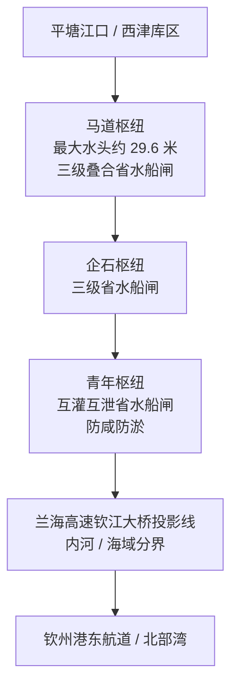

> **风险与合规提示：** 工程参数、货运预测和节约运费数字来自政府发布、环评批复与通航报道，部分尚未被独立审计或全年运行数据验证。资料用于理解通道、港口和区域分工，不构成投资、开户、项目决策或法律建议。

## 一、先给结论

**平陆运河已经把西江和北部湾连起来。** 西南大宗货不必再沿西江一直漂到珠江口，再折返南下。全球远洋干线不走这条河。

目前能站住的判断有五条：

1. **工程本身已经完工并开航。** 2022 年 8 月 28 日开工，2026 年 8 月交工验收，9 月 16 日建成通航。全长 134.2 公里，估算总投资约 727 亿元，按内河Ⅰ级、5000 吨级船舶建设。试运行期到 2027 年 9 月 15 日。
2. **改写的是西南内河出海的那一段。** 官方口径是：较经广州港等传统路径，内河航程缩短 560 公里以上；综合物流成本降低 18%—30%；每年节约运输费用超 50 亿元。后两个数字是通航前测算，还不是实测账本。
3. **它更像基尔运河加江汉运河，不像苏伊士或巴拿马。** 船闸尺寸接近老巴拿马闸室的长和宽，吃水和船型仍是内河 5000 吨级。它给云贵桂川渝一条更短的向海水道，不替代马六甲、苏伊士或巴拿马的跨洋通道。
4. **经济影响先落在大宗货和港口腹地。** 煤炭、矿石、砂石、水泥、铝材、磷肥、粮食更可能改道；广州港 2025 年 6.99 亿吨、2805 万标箱的体量不会被一条运河整体替代。北部湾港 2025 年已迈过 1000 万标箱，运河给它补的是江海联运腹地。
5. **环境和用水是硬约束。** 开挖土石方约 3.15 亿—3.17 亿立方米，移民安置约 1.12 万人，近期调水 24 立方米/秒。船闸必须省水，青年枢纽还要挡住盐水上溯。运河能不能常年满负荷，取决于货、水和调度，不只取决于通航仪式。

对观察者：**跟进**试运行过闸量、货种和江海直达运价；**观望**珠三角散货分流和沿线产业带兑现；**不跟进**把规划节约额当成已发生收益，也不据此买卖北部湾港或物流股。

## 二、事实层

### 1. 这条河在地图上做什么

西江黄金水道向东入珠江口。北部湾港口向南对着东盟。中间隔着分水岭。广西临海，内河货过去却很难就近入海。

平陆运河北起南宁横州市西津库区平塘江口，经钦州灵山县陆屋镇，沿钦江到钦州港东航道，汇入北部湾。名称取平塘江口的「平」和陆屋的「陆」。

旧路：西南货沿西江东行，过梧州长洲枢纽，到珠江口再出海。新路：在平塘江口掉头向南，过三座船闸入海。上游仍连邕江、左江、右江；向东仍可去粤港澳；向北经黔江、红水河或柳江可及贵州。

孙中山在《建国方略》里写过以钦州为出海口、北接西江的设想。秦代灵渠沟通湘漓，服务的是中原到岭南；平陆运河服务的是岭南腹地到北部湾。两条河都在广西，任务不同。

### 2. 可以核对的工程参数

| 项目 | 公开口径 | 来源 |
|---|---|---|
| 通航日 | 2026-09-16 | [交通运输部](https://www.mot.gov.cn/xinwen/jiaotongyaowen/202609/t20260908_4223957.html)、[新华社](https://www.xinhuanet.com/20260916/6d28ab0b03ec4e61afddebfabee71494/c.html) |
| 开工日 | 2022-08-28 | 同上 |
| 交工验收 | 2026 年 8 月 | [新华社 2026-09-17](https://www.news.cn/politics/20260917/72f7047378ab4adc874444c777d6de39/c.html) |
| 试运行 | 2026-09-16 至 2027-09-15 | [Container News](https://container-news.com/china-opens-pinglu-canal-launching-new-shipping-gateway-to-asean/) |
| 长度 | 134.2 公里 | 交通运输部、新华社 |
| 投资 | 约 727 亿元；广西发改委可研口径估算总投资 727.3 亿元 | [交通运输部](https://www.mot.gov.cn/xinwen/jiaotongyaowen/202609/t20260908_4223957.html)、[广西发改委批复附件](http://fgw.gxzf.gov.cn/zfxxgkzl/fdzdgknr/zdjsxmpzhsslygk/pzjg/P020220809678429384527.pdf) |
| 航道等级 | 内河Ⅰ级，通航 5000 吨级 | 同上 |
| 航道尺度 | 水深 6.3—6.5 米，底宽 80—100 米 | Container News 转述管理中心 |
| 总落差 | 约 65 米 | 交通运输部 |
| 船闸 | 马道、企石、青年，各双线；闸室有效尺度 300 米 × 34 米，门槛水深 8 米 | 广西发改委批复、Container News |
| 2050 年双线单向设计通过能力 | 约 8900 万吨 | 广西发改委批复 |
| 环评预测货运量 | 2035 年 1 亿吨，2050 年 1.5—1.8 亿吨 | [桂环审〔2022〕222 号](http://sthjt.gxzf.gov.cn/zfxxgk/zfxxgkgl/fdzdgknr/hjjccf/hjyxpj/t12737452.shtml) |
| 土石方 | 环评 3.17 亿立方米（自然方）；通航报道约 3.15 亿立方米 | 环评批复、[人民网 2026-02-02](https://cpc.people.com.cn/n1/2026/0202/c64387-40657499.html) |
| 永久占地 | 2739.91 公顷 | 环评批复 |
| 移民 | 2764 户、11228 人 | [Al Jazeera 转述官方](https://www.aljazeera.com/news/2026/9/16/whats-the-pinglu-canal-chinas-new-gateway-to-southeast-asia) |
| 近期调水 | 24 立方米/秒，经百色水库优化调度；远期 40 立方米/秒，经南盘江调水工程 | 环评批复 |

航道五段大致是：沙坪河段 21 公里、分水岭段 29.5 公里（其中新开挖越岭约 6.5 公里）、钦江干流 48.5 公里、钦江城区 21.6 公里、入海口近海 14.4 公里。大部分是原河道裁弯取直、拓宽挖深，真正新切开的山体只有数公里。

马道是上游第一级、落差最大的闸。建设方称闸室 300 米 × 34 米，省水率超 60%，阀门启闭快于常规船闸。青年枢纽在下游，省水率约 50%，并承担江海交汇和防盐水上溯。环评要求青年枢纽新增下泄流量原则上不超过 20 立方米/秒，超过就要再论证对茅尾海湿地的影响。

以 G75 兰海高速钦江大桥南侧投影线为界，北侧按内河管理，南侧按海域管理。广西划了全国首个「相当 A 级航区」：符合条件的内河船可以合法靠泊钦州海港码头，海船和国际航行船舶也可以从北部湾进入运河。过去内河船到海口必须再中转一次。

### 3. 通航当天已经发生的事

首航船队 9 月 16 日从马道枢纽南下。同日开通「南宁港—越南芹苴港」直达外贸航线和「南宁港—洋浦港」江海直达货运航线。通航前，海事登记具备运河资质的船舶约 570 艘，681 名船长、驾驶员拿到航线签注。

货种线索已经具体到船：四川、重庆、广西的建材和化工原料，柳州的五菱汽车零配件，经铁路到南宁港再走运河去芹苴；老挝钾肥经越南海运到钦州，再经运河去贵港。中新网报道一票 3012.66 吨氯化钾，称较传统线路少绕近 500 公里、缩短 5—7 天。这些是首航和备货案例，还不是年度结构。

收费安排据 Al Jazeera 转述：2026 年 12 月 31 日前过闸免费；2027 年 1 月 1 日起按船舶核载每吨 1 元收取过闸费，试行至 2031 年 9 月。是否按三座枢纽分别计费，应以平陆运河管理中心正式费率表为准。

### 4. 国内对照：从灵渠、京杭大运河到江汉、江淮

| 运河 | 开通 / 现状 | 长度 | 通航对象 | 它解决什么 |
|---|---|---|---|---|
| 灵渠 | 公元前 214 年前后凿成；1958 年后基本断航 | 36.4 公里 | 历史木船、灌溉 | 沟通湘江与漓江，服务中原到岭南 |
| 京杭大运河 | 隋唐至元明清叠修，仍在运货 | 约 1800 公里量级 | 内河驳船 | 海河、黄河、淮河、长江、钱塘江之间的南北内河骨干 |
| 江汉运河 | 2014-09-26 | 67.22 公里 | Ⅲ级、1000 吨级 | 长江中游到汉江中游少绕约 680 公里 |
| 江淮运河（引江济淮通航段） | 2023-09-16 全线试运行 | 约 355 公里 | 2000 吨级 | 长江与淮河直连，少绕京杭大运河 200—600 公里 |
| **平陆运河** | **2026-09-16** | **134.2 公里** | **Ⅰ级、5000 吨级** | **西江到北部湾，少绕 560 公里以上** |

灵渠证明广西运河传统很长，也证明航运会被铁路、公路替代。江汉运河证明「缩短绕行」在中国现代运河里已经用过一次：开通后一年多，累计货运约 57 万吨，远低于设计年通过能力。设计能力写成亿吨，不保证第一年就有亿吨货。

交通运输部对后续跨水系运河的口径是「一河一策」、科学审慎。湘桂运河、浙赣粤运河（浙赣段 + 赣粤段）仍在预可研或综合效益论证，尚未达到平陆运河这种已通航状态。平陆运河是汉湘桂通道「四纵」里先落地的一段，不是整张南方运河网已经完成。

西江既有瓶颈也说明分流空间有上限。珠江航务局统计：2025 年长洲枢纽过闸货运量 2.24 亿吨，船舶 12.36 万艘次；下行以碎石、机制砂、水泥为主，上行以煤炭、铁矿、粮食为主。一线二线船闸因水头差超设计全年停航 122 天，日均待闸仍有 422 艘。平陆运河分流的，首先是这张货单里适合南下入海、而不是东去珠三角消耗的部分。

### 5. 国际对照：同叫运河，功能差一个数量级

| 运河 | 长度 | 船型上限 | 近年运量 / 通行 | 功能 |
|---|---|---|---|---|
| 苏伊士 | 193.3 公里，海平面，无船闸 | 可过大型海轮 | 2025 年 1.28 万艘、5.22 亿苏伊士净吨；红海危机前曾约 12 亿净吨量级 | 亚欧海运主通道 |
| 巴拿马 | 约 82 公里 | 老闸室 304.8 × 33.5 米；新闸 427 × 55 × 18.3 米，可过超 1.4 万 TEU 船 | FY2025 通行 1.34 万艘次、4.89 亿 PC/UMS 吨，收入约 57 亿美元 | 连接大西洋与太平洋 |
| 基尔 | 98.6 公里 | 大海轮，闸室可用 310 × 42 米 | 2025 年 2.23 万艘、6940 万吨货 | 北海—波罗的海少绕约 460 公里 |
| 莱茵—美因—多瑙 | 171 公里，16 座船闸 | 欧洲内河船，吃水约 4 米 | 近年货运常在数百万吨量级，远低于开通初期预期 | 北海到黑海的内河联网 |
| **平陆** | **134.2 公里，3 座梯级** | **内河 5000 吨级，闸室 300 × 34 × 8 米** | **通航 3 天，尚无年度运量** | **西江到北部湾 / 东盟近洋** |

平陆船闸的长和宽，看起来接近 1914 年巴拿马老船闸。吃水差了一截：巴拿马老船闸限制吃水约 12.6 米，新船闸更深；平陆门槛水深 8 米，服务的是 5000 吨级江海直达船，不是 1 万标箱海轮。把闸室尺寸直接翻译成「中国版巴拿马」，尺度对不上。

基尔运河才是功能上更近的参照：都是用一条人工水道，让船少绕几百公里。基尔省的是日德兰半岛外的海路，平陆省的是西江东去珠江口的内河路。莱茵—美因—多瑙河运河则提醒另一件事：联网成功之后，货运量仍可能长期低于政治叙事。

克赖运河（泰国克拉地峡）和尼加拉瓜运河常被拿来和中国通道放在一起讲。前者未建，后者搁浅。平陆运河已经通航，但地理任务不同：它在中国境内把内河接到自己的海港，不在他国领土上另开一条绕开马六甲的远洋捷径。

## 三、结构分析

### 1. 物流上，它切的是哪一层

西南货出海至少有四层：

1. 矿山、工厂到内河港或铁路货场；
2. 西江、铁路、公路到沿海枢纽；
3. 海港装卸、支线和干线航班；
4. 东盟近洋或更远的远洋。

平陆运河主要改第 2 层，并创造第 2 层和第 3 层之间的江海直达。铝土、磷矿、水泥、砂石对绕行公里和装卸次数敏感；电子产品、跨境电商、欧美干线集装箱对航班密度、航线网络和枢纽服务更敏感。后者仍集中在粤港澳和大湾区港口群。

2025 年对照数字把量级摊开：广州港货物吞吐量 6.99 亿吨、集装箱 2805.09 万标箱；北部湾港集装箱突破 1000 万标箱，北部湾港股份口径货物吞吐量 3.58 亿吨。运河即使按环评 2035 年 1 亿吨货运量跑满，也是一条高等级内河通道的成功，不是华南港口格局的整体翻转。

西部陆海新通道里，铁海联运已经先跑了几年。2025 年 12 月 30 日，北部湾港吊装第 1000 万标箱的同时，通道铁海联运班列开到第 10218 列。运河加入后，西南到北部湾变成「铁、公、水」三条腿，水运吃的是大宗、低时效敏感、适合 3000—5000 吨级船的货。

### 2. 经济账：能确认的成本和还不能确认的红利

能确认的投入大约是 727 亿元、4 年工期、约 5.4 亿元/公里。环评阶段环保投资 25.52 亿元。移民、占地、饮用水源保护区穿越、红树林占用，已经写进批复，不是通航后才出现的问题。

还不能确认的是每年超 50 亿元节约额。广西官方同时给出 18%—30% 的综合物流成本降幅。中国证券报通航稿里，广西江南纸业称公路转运河去北部湾「预计可节省运费约 20%」；柳州水泥货主说单批能省几十万元、十几天。企业口述和政府测算方向一致，基数、货种权重和回程空载都还没有公开分项。

过闸免费期会压低 2026 年四季度的账面成本。2027 年起每吨核载 1 元的试费率，相对 727 亿元造价是象征性回收，目的更像培育货流。真正的财务闭环在港口作业费、船东运价、产业税收和土地开发，不在过闸费本身。

环评预测 2035 年 1 亿吨、2050 年 1.5—1.8 亿吨；可研双线单向设计能力 2050 年约 8900 万吨，并预留三线。两套规划口径并不咬合。通航三年内，用实际过闸吨和货种结构去核对，比继续引用 2050 年数字更有用。

### 3. 谁受益、谁被分流、谁还在观望

**广西和北部湾港。** 南宁港从内河港变成江海联运始发港。钦州、防城、北海组成的北部湾港得到西江腹地。广西提出以运河经济带为主脉的「叶脉式」向海产业布局，目标行业包括有色金属、绿色化工、适港制造业。法国爱森集团称 15 亿元造纸化学品项目落户南宁六景，运河是投资决策的关键因素。这是企业自己的表述，还不是带的普遍规律。

**云南、贵州、川渝的适水产业。** 云南绿色铝、磷化工，贵州钢铁和轮胎，重庆到南宁的铁水联运，都在对接会上出现。石油焦经钦州上岸再走运河到富宁港，是神火铝业公开算过的账。前提是右江、富宁港和省际航道同步提级。运河本身到平塘江口为止，上游不通，货到不了滇黔。

**粤港澳港口群。** 西江下行砂石、水泥过去大量服务珠三角建设。长洲 2025 年下行货运 1.72 亿吨，碎石、机制砂、水泥合计超过六成。若其中一部分改走钦州出海，佛山、肇庆、江门的内河中转会丢货。广州港外贸箱 2025 年增速近 20%，主业已经转向外贸和全货种枢纽；低附加值散货分流，对它可能是结构变化，对西江沿岸中小码头才是直接冲击。物流公司自媒体把「六成低毛利货转向钦州」写得很满，未见官方分项预测，只能当市场传言。

**东盟近洋。** 海关总署：2026 年上半年中国—东盟进出口 4.34 万亿元，同比增长 18.2%。北部湾到越南海防、胡志明、芹苴，比西南货先到广州再出海更顺。回程如果吃不满，船东会用低价揽东盟农产品、木材、橡胶北上。双向货流能不能对称，决定运河是「出海捷径」还是「单边放空」。

### 4. 环境与移民：环评写过的硬条件

工程穿越 5 处饮用水水源保护区，占用永久基本农田 849 公顷，占用野生红树林约 13.9 公顷，评价范围内有鱼类产卵场和珍稀鱼类。路线避让茅尾海红树林保护区，最近距离 700 米。青年枢纽设鱼道，并要求集咸坑等措施防止过闸盐水上溯。

土石方消纳规划了 202 处堆存或消纳场。建设报道称综合利用率达 98% 以上，用于抬填造地、园区回填、矿坑修复和建材。环评仍要求临时用地 5658 公顷。利用率高，不等于占地和水土流失消失。

移民 1.12 万人。Al Jazeera 写到横州拆除 368 户、临时安置 1221 人，新村按 21 种户型设计。凤凰坪村名消失，有居民把两百年香樟移到新址。39 天集中搬迁配套了工地就业和职业培训承诺。社会成本已经支付；就业承诺是否兑现，要看运河运营期，不是通航当天。

用水更卡脖子。西江水要分给航运、灌溉、生态和珠江下游。马道、企石用三级省水池，青年用互灌互泄，三大枢纽宣传口径是每年节水超 10 亿立方米、省水率 50%—60%。巴拿马运河近年因 Gatun 湖水位限制过闸，已经演示过：运河运力最终受水约束。平陆运河的节水船闸，是对同一类约束的工程回答。

### 5. 国际政治叙事里被放大的部分

通航稿常把运河写成面向东盟的「超级通道」，个别评论再把它接到马六甲、霍尔木兹和供应链安全。Al Jazeera 也把平陆运河放进「国家寻找替代通道」的背景里。地理事实更窄：

- 西南内陆到北部湾、到越南近洋，距离和时间会下降。
- 中国到欧洲、中东的远洋集装箱，仍走南海、马六甲或好望角、苏伊士。平陆运河不在这条路上。
- 西部陆海新通道的铁路已经在分担西部到北部湾的箱运。运河补的是体大价低的水运，和中老铁路的「快货」不是同一层。

新加坡国立大学余虹的评论是：地理邻近可能转化成产业合作密度。这是可能，取决于关税、产业配套、港口服务和越南港口接卸，不自动发生。

## 四、外部研判

把平陆运河看成「中国的苏伊士」，尺度错了。看成「广西终于把西江接到自己的海」，才对得上 134.2 公里和 5000 吨级。

我的判断：

**对西南大宗货主：跟进。** 试运行期过闸免费或低费，江海直达船已经有首批。铝、磷、水泥、砂石、煤炭，只要上游航道和两端港口接得住，运价和时效有机会优于「西江东去 + 珠江口中转」。需要盯的是待闸时间、船闸 24 小时兑现率、台风和洪水停航天数。长洲枢纽 2025 年一线二线停航 122 天，说明华南水运的天气和水文风险不会因为新开一条河而消失。

**对北部湾港和南宁港：有条件跟进。** 港口 2025 年已经靠铁海联运和东盟航线长到千万标箱。运河提供增量腹地，但 16 日首航到形成稳定班轮，中间要过货源组织、海关监管、锚地过驳和回程货。2024 年券商研报把长洲货里约 5000 万吨写成「有望」转向运河、再派生近亿吨水水中转。那是情景测算，不是已签约运量。

**对广州港和珠三角内河中转：观望分流结构，不观望存亡。** 广州港 2025 年外贸箱增速近 20%，体量仍是北部湾的数倍。可能被切走的是西江建材东进和部分东盟近洋散货。大湾区港口群内部本来就在分工：香港国际航运、深圳远洋、广州综合枢纽。平陆运河加速的是「大宗货南下广西、高附加值仍留大湾区」这条已有趋势。

**对湘桂、浙赣粤等后续运河：观望国家决策，不提前当成已建网络。** 平陆运河工期短、一次性建成双线 5000 吨级，会被拿来当样板。交通运输部仍要求对跨长江、珠江水系工程审慎论证。江汉运河和莱茵—美因—多瑙河运河都说明：缩短绕行的工程可以很快完成，货流培育要慢得多。

**对把运河写成马六甲替代的叙事：不跟进。** 它降低的是中国西南到北部湾和东盟近洋的内河成本，不改变全球海运咽喉。

**对二级市场：不跟进。** 北部湾港、建材、航运、广西本地基建相关公司会讲故事。通航 3 天，没有可审计的过闸年报。规划节约额、2035 年亿吨货运和产业带签约额，都还不能当业绩。

## 五、信息来源与持续验证

资料截至 2026 年 9 月 19 日。通航仅 3 天，年度过闸量、实际运价和生态后评价都还没有。

主要来源：

- 交通运输部通航发布：[平陆运河将于 9 月 16 日建成通航](https://www.mot.gov.cn/xinwen/jiaotongyaowen/202609/t20260908_4223957.html)
- 新华社：[建成通航](https://www.xinhuanet.com/20260916/6d28ab0b03ec4e61afddebfabee71494/c.html)、[通江达海向未来](https://www.news.cn/politics/20260917/72f7047378ab4adc874444c777d6de39/c.html)
- 广西发改委项目批复附件：[工程分段、船闸与投资构成](http://fgw.gxzf.gov.cn/zfxxgkzl/fdzdgknr/zdjsxmpzhsslygk/pzjg/P020220809678429384527.pdf)
- 广西生态环境厅：[桂环审〔2022〕222 号](http://sthjt.gxzf.gov.cn/zfxxgk/zfxxgkgl/fdzdgknr/hjjccf/hjyxpj/t12737452.shtml)
- 珠江航务局：[2025 年长洲船闸通航简报](https://zjhy.mot.gov.cn/zzhxxgk/jigou/jsdw/202601/t20260113_4197033.html)
- 广州市统计局 / 港务局：2025 年广州港 6.99 亿吨、2805.09 万标箱
- 新华网广西：北部湾港 2025 年集装箱突破 1000 万标箱
- 北部湾港股份 2025 年报摘要：全港货物吞吐量 35766.65 万吨
- Al Jazeera、Container News、CGTN：独立或英文通航报道，移民、收费、试运行和船闸尺度可与中文官方交叉
- 新华社：引江济淮江淮运河 2023 年 9 月 16 日全线试运行，航道约 355 公里、2000 吨级
- 巴拿马运河管理局 FY2025、苏伊士运河厅 2025 年报、德国基尔运河 2025 年统计：国际对照运量

持续验证（会改变结论的缺项）：

1. 2026-09-16 至 2027-09-15 试运行过闸艘次、货运吨、货种和上下行空载率。
2. 西江长洲枢纽过闸量是否同步下降，下降发生在哪些货种。
3. 北部湾港 2026—2027 年货物吞吐量和集装箱增量，能否从铁海联运里单独拆出江海联运。
4. 青年枢纽下泄、茅尾海盐度、红树林和鱼道效果的环境影响后评价。
5. 正式费率表：1 元/吨是按运河计一次，还是按三闸分别计。
6. 右江、富宁港、南宁至贵港Ⅰ级航道是否按期提级；否则滇黔货仍会卡在上游。
