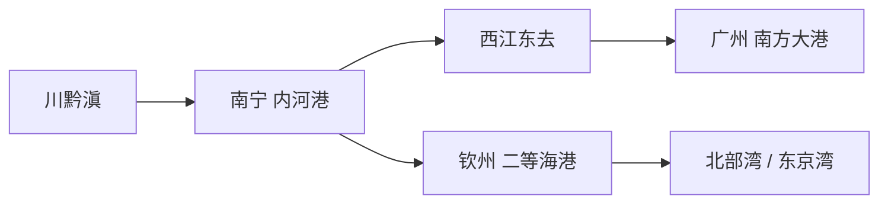

> **风险与合规提示：** 对照的是公开原文和已建成工程，用来核对地理与运价逻辑。不构成投资、政策或工程决策建议。落地按功能是否建成计，不等于按 1919 年图纸原样施工。

## 一、先给结论

**孙中山把钦州写成出海口，算的是腹地距离：川黔滇和广西西部若再绕去广州入海，要多走约 400 英里；南宁更近腹地，却只能当内河港。** 2026 年 9 月 16 日通航的[平陆运河](/articles/research/topics/pinglu-canal)，把西江接到钦州港，做的是同一笔账的水运版。

目前能站住的判断有五条：

1. **原文在《建国方略·物质建设》第三计划。** 英文本 1918–1920 年写成，中文本 1921 年刊行。钦州是四个二等海港的最后一位，排在营口、海州、福州之后。广州才是南方大港。
2. **他给的数字很具体。** 钦州在东京湾（北部湾）顶上，广州以西约 400 英里；海运大约比铁路便宜 20 倍。南宁「不能有海港之用」，所以直接出洋仍以钦州为最省俭的积载地。
3. **北接西江是地理必然。** 西江当时就能把较小汽船送到南宁。缺的是南宁到海的短轴。他要的三件套是：浚深龙门江、株钦铁路、广州钦州线在钦州会合。
4. **平陆运河对上的是功能，对不上原图纸。** 官方口径是内河少绕 560 公里以上；孙中山测的是沿海少绕 400 英里。株洲到钦州没有按原名建成一条铁路。湘桂、南防、洛湛、南钦把那条脊梁拆开铺了。
5. **同一类设想里，已经建成的不止这一条河。** 三峡、青藏铁路、曹妃甸、广州港、连云港、武汉长江大桥、江汉运河、全国铁路营业里程突破 16 万公里，都能在《实业计划》里找到对应命题。

对读者：**跟进**原文三句话和已建成对照；**观望**改线、未建和仍在铺的工程；**不跟进**把《建国方略》当施工图，也不据此买卖北部湾港或广西基建股。

## 二、事实层

### 1. 原文怎么写钦州

维基文库《物质建设 / 第三计划》「丁 钦州」：

> 钦州位于东京湾之顶，中国海岸之最南端。此城在广州即南方大港之西四百英里。凡在钦州以西之地，将择此港以出于海，则比经广州可减四百英里。通常皆知海运比之铁路运价廉二十倍，然则节省四百英里者，在四川、贵州、云南及广西之一部言之，其经济上受益为不小矣。虽其北亦有南宁以为内河商埠，比之钦州更近腹地，然不能有海港之用。所以直接输出入贸易，仍以钦州为最省俭之积载地也。

同节后半段把工程和排序写死了：先整治龙门江，浚深河口并筑堤，让深水道直达钦州城；此港已选定为株钦铁路终点。腹地比福州大，仍排在福州之后，因为国内贸易和间接输出入会被广州世界港、南宁内河港分走，「惟有直接贸易始利用钦州耳」。

同计划「乙 西江」：较大航河汽船可到距广州 220 英里的梧州，较小汽船可到南宁，小船西至云南边界、北至贵州边界，东北经兴安运河（灵渠）通湖南和长江。南宁已经在西江网上。钦州要做的，是给这张网一个自己的海口。

铁路部分有两条线在钦州交汇：

- **广州钦州线**：约 400 英里，经开平、恩平、阳春、高州、化州、廉州到钦州，再至东兴，对岸接海防方向的法国铁路。当时写在广东省范围内。钦州 1965 年划归广西，行政归属变了，地理账没有变。
- **美国经营的株洲钦州计划线**：交甲线于永州、乙线于全州、丙线于桂林、丁线于柳州、戊线于迁江、己线于南宁，「而与庚线会于钦州」。

东出广州是当时西南货的默认海路。南出钦州省下的，是广州以西那一截。平陆运河把「南出」做成了河；工程参数、货种和试运行口径见[平陆运河通航](/articles/research/topics/pinglu-canal)。

### 2. 《实业计划》里已经能对上工程的条目

「落地」按功能是否建成计。选址、线位、船型往往改过。

| 设想 | 原文要点 | 后来建成 | 年份 | 对应程度 |
|---|---|---|---|---|
| 钦州出海、北接西江 | 东京湾顶的二等港；南宁内河、钦州出海；株钦铁路终点 | 钦州港、南防铁路、南钦铁路、平陆运河 | 港航 1990s–2026 | 功能对齐；运河补了铁路没单独完成的那一截 |
| 三峡水闸 | 「当以水闸堰其水，使舟得溯流以行，而又可资其水力」 | 葛洲坝、三峡工程 | 1981 / 2006–2009 | 航道加发电都做成了，尺度远超当年 |
| 高原铁路 / 火车进藏 | 拉萨通往兰州、成都、大理等线 | 青藏铁路；川藏铁路在建 | 2006 起 | 进藏已通，高原路网仍在铺 |
| 北方大港 | 直隶湾、大沽与秦皇岛中途，青河、滦河两口之间，深水不冻 | 京唐港、曹妃甸港区 | 1990s–2000s | 选址接近原图 Sha-lui-tien / 曹妃甸 |
| 南方大港 | 「当然为广州」 | 广州港、黄埔、南沙 | 持续扩建 | 位置一致，体量已是世界级 |
| 东方大港 | 首选杭州湾乍浦，上海为备选改良 | 上海洋山、宁波舟山 | 2005 起 | 功能落地，主港留在了上海湾区 |
| 海州二等港 | 海兰铁路终点，北通黄河、中通长江、南通西江 | 连云港 + 陇海线 | 1930s 起 | 港和东西大干线都在 |
| 武汉三镇桥隧 | 汉水口建桥或隧道，联络武昌、汉口、汉阳为一市 | 武汉长江大桥及后续桥隧 | 1957 起 | 第一座公铁两用桥把京汉、粤汉接上 |
| 沙市开运河通江汉 | 「须新开一运河，沟通江汉」，汉口赴沙市以上得捷径 | 引江济汉 / 江汉运河 | 2014 | 67.22 公里；沙市到潜江少绕约 681 公里 |
| 全国铁路 10 万英里 | 约 16 万公里现代化路网 | 中国铁路营业里程突破 16 万公里 | 2024 | 总量达标，线位是另一张网 |

三峡原文在第二计划整治长江上游：「自宜昌而上，入峡行，约一百英里而达四川之低地……改良此上游一段，当以水闸堰其水，使舟得溯流以行，而又可资其水力。」1924 年《民生主义》演讲补了发电规模：宜昌到万县一带「可以发生三千余万匹马力」。先改善航道，发电是附带收益。后来的三峡工程把防洪、发电、航运捆在一起，命题来自这里，设计不是 1919 年那一页。

江汉运河的数字与平陆同构：都是少绕几百公里。2014 年 9 月 26 日通航，全长 67.22 公里。荆州到潜江走运河，比沿长江绕道少约 681 公里。开通后一年多累计货运约 57 万吨，远低于设计年通过能力。缩短绕行可以很快完成，货流培育要慢得多。

### 3. 更早和更后的同构工程

判断标准可以收成一句：腹地太大，不能让所有货、水、兵、粮都去迁就一个龙头地点；隔着分水岭或绕路的地方，值得开一条人工通道。

| 设想者 | 判断 | 工程 | 落地 |
|---|---|---|---|
| 李冰 | 把岷江从水患改成可灌可航的成都平原 | 都江堰 | 前 256 年前后，仍在用 |
| 秦始皇 | 长江水系接到珠江水系，兵粮南下 | 灵渠 | 前 214 年 |
| 隋炀帝 | 华北政治中心接到江南粮仓 | 大运河 | 605–610 年，后世多次改线 |
| 毛泽东 | 1952 年 10 月 30 日：「南方水多，北方水少，如有可能，借一点来是可以的。」 | 南水北调东线、中线 | 2013 / 2014；西线未建 |
| 三线建设决策 | 西南要有自己的工业走廊 | 成昆铁路 | 1970 年 |

灵渠和平陆运河都在广西。灵渠沟通湘江与漓江，服务中原到岭南；平陆沟通西江与北部湾，服务岭南腹地到自己的海。方向相反。

国外同构工程：苏伊士少绕非洲，1869 年通航；巴拿马少绕合恩角，1914 年通航；基尔运河少绕日德兰，1895 年通航；伏尔加—顿河运河 1952 年通航；美国州际公路网 1956 年立法开建。平陆在功能上更接近基尔：省的是绕行，对象是区域水道。跨洋咽喉仍是苏伊士和巴拿马。

## 三、结构分析

《实业计划》的骨架是：港口为点，铁路和水道为轴，腹地走最近的海。北方大港吃晋煤和西北；东方大港吃长江三角洲；南方大港吃珠江三角洲。钦州出现，是因为广州再大，也管不住广州以西 400 英里的直接出洋。

三层分工写得很克制：

1. **广州**吃国内贸易和转口，是世界港。
2. **南宁**吃西江腹地集散，是内河港。
3. **钦州**只抢直接出洋。所以排在四个二等港最后。

北部湾后来超过这个排序，因为东盟近洋和西部陆海新通道把「直接出洋」的货盘做大了。1919 年他还看不到集装箱班轮和中国—东盟贸易的体量。海关总署：2026 年上半年中国—东盟进出口 4.34 万亿元，同比增长 18.2%。这笔货让钦州的「直接贸易」假设，比当年更站得住。

他要的北向主轴是铁路。平陆运河把同一条短轴做成了 134.2 公里、5000 吨级内河航道。水运仍然比铁路便宜，只是载体从「株钦火车 + 龙门江浚深」换成了「西江船直接出钦州港」。运价逻辑没有改。

400 英里和 560 公里不要混成一个数。孙中山量的是钦州相对广州的沿海位置；平陆量的是西江货改走运河、少绕珠江口的内河里程。弯路是同一段，尺子不同。

## 四、外部研判

**对读《建国方略》的人：跟进原文三句话。** 先核对钦州、西江、株钦三节，再看地图。400 英里、海运便宜约 20 倍、南宁当不了海港，这三项现在仍能解释为什么广西要有自己的海口。工程细节以当代可研、环评为准。

**对理解平陆运河的人：跟进功能对照，分开两篇的任务。** 运河已经通航、改的是西南内河出海那一层，见[平陆运河通航](/articles/research/topics/pinglu-canal)。这里只补它在百年命题里的位置：广西把西江接到自己的海。试运行过闸量、货种和运价，以那一篇的持续验证为准。

**对三峡、青藏、南水北调、江汉运河：跟进已建成事实，观望仍在铺的部分。** 进藏已通，川藏铁路仍在建。南水北调东线、中线已通水，西线没有建。铁路 16 万公里是路网总量，不是孙中山画过的每一条线都在。

**对株钦原线、东方大港乍浦方案：观望史实，不当成漏建清单。** 湘桂、南防、洛湛、南钦已经把湖南到北部湾连上。上海湾区用洋山和宁波舟山完成了东方大港的功能，主港没有落在乍浦独港。改线不等于失败。

**把 1919 年图纸当施工图：不跟进。** 船型、港址、省界和贸易对象都变了。他把钦州写成第四等海港；今天的北部湾港已经不是那个位置。

**把平陆运河写成苏伊士或马六甲替代：不跟进。** 它降低的是中国西南到北部湾和东盟近洋的内河成本。远洋集装箱仍走南海、马六甲或好望角、苏伊士。

**据此买卖北部湾港、广西基建或物流股：不跟进。** 通航初期没有可审计的过闸年报。规划节约额和 2035 年亿吨货运，都还不能当业绩。

## 五、信息来源与持续验证

资料截至 2026 年 9 月 19 日。

主要来源：

- 维基文库：[物质建设 / 第三计划](https://zh.wikisource.org/wiki/%E7%89%A9%E8%B3%AA%E5%BB%BA%E8%A8%AD/%E7%AC%AC%E4%B8%89%E8%A8%88%E5%8A%83)（钦州、西江、广州钦州线、株钦铁路、海州）
- 辛亥革命网转载外语教学与研究出版社《实业计划》中文版：长江上游水闸原文
- 中国水力发电工程学会、电力网转述：1924 年《民生主义》宜昌—万县水力演讲
- 交通运输部、新华社：平陆运河 2026-09-16 通航；详见本站[平陆运河](/articles/research/topics/pinglu-canal)
- 新华社 2024-09-18：中国铁路营业里程突破 16 万公里
- 人民网、湖北省政府网：江汉运河 2014-09-26 通航，67.22 公里；毛泽东 1952-10-30 南水北调谈话
- 唐山市人民政府、人民网党史频道：北方大港选址与曹妃甸
- 海关总署：2026 年上半年中国—东盟进出口 4.34 万亿元

持续验证（会改变结论的缺项）：

1. 平陆运河试运行过闸量和货种，是否让「直接出洋走钦州」从命题变成年度结构。
2. 川藏铁路通车后，高原铁路系统还缺哪几条《实业计划》里写过的拉萨放射线。
3. 南水北调西线若立项或明确搁置，会改写「借水」这条对照的完成度。
