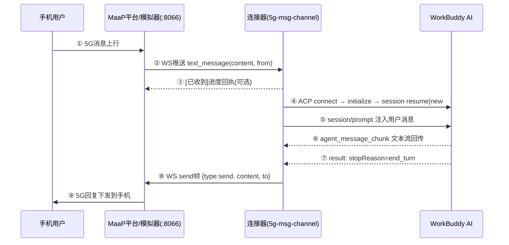

# 5g-msg-channel 连接器 — 消息时序图（SEQUENCE）

> 版本：1.0.0（2026-09-08）｜配套：`connector/docs/INSTALL.md`
> 用途：展示一条 5G 消息从手机发出到收到 AI 回复的完整时序，供联调/排障对照。
> 本文档含 Mermaid 源码（GitHub/VSCode/支持 Mermaid 的编辑器可直接渲染成图）。

---

## 1. 一句话流程

```
手机用户 ──▶ MaaP 平台/模拟器(8066) ──▶ 连接器(5g-msg-channel) ──▶ WorkBuddy(AI)
    ▲                                                                   │
    └────────────── 5G 回复下发 ◀── WS send 帧 ◀── 回复文本 ────────────┘
```

四个参与者：
- **手机用户**：5G 终端，发消息/收回复
- **MaaP 平台**：真实网关，联调用模拟器 `ws://127.0.0.1:8066/ws`
- **连接器**：本组件（maap-client + bridge + acp-client 三模块）
- **WorkBuddy**：真实 AI 引擎（经 ACP 对接）

---

## 2. Mermaid 时序图源码



---

## 3. 逐步说明

| # | 方向 | 动作 | 触发条件/细节 |
|---|---|---|---|
| ① | 手机 → 平台 | 5G 消息上行 | 用户在手机发消息给聊天机器人 |
| ② | 平台 → 连接器 | `{type:"text_message", content, from}` | WS 长连接实时推送；连接器归一化 `{id, sender, text, replyTarget}` 入队 |
| ③ | 连接器 → 平台 | `{type:"send"}` 进度回执「已收到/思考中/调用工具」 | 可选；`NO_PROGRESS=1` / `PHONE_PROGRESS=0` 关闭 |
| ④ | 连接器 → WorkBuddy | ACP 握手 | connect → initialize → session/resume（**失败/超时自动 session/new 并持久化**） |
| ⑤ | 连接器 → WorkBuddy | `session/prompt` | SSE 长连接订阅 `session/update` 活动事件 |
| ⑥ | WorkBuddy → 连接器 | `agent_message_chunk` | 文本在 `content.text`，连接器按增量拼接（修复后版本） |
| ⑦ | WorkBuddy → 连接器 | `result{stopReason:"end_turn"}` | 回合结束信号 |
| ⑧ | 连接器 → 平台 | `{type:"send", content, to}` | 真实网关 send 成功**无 ack 帧**；2s 内收到 error 帧则重试一次 |
| ⑨ | 平台 → 手机 | 5G 回复下发 | 用户手机收到 AI 回复 |

---

## 4. 关键机制（排障对照）

| 机制 | 行为 |
|---|---|
| 串行队列 | 同一号码消息逐条处理，保证不乱序；不同号码并发为 v2 规划 |
| 看门狗 | 单任务超时（默认 120s）强制释放 → 回「处理超时」，防队列死锁 |
| 会话降级链 | resume 失败 → new → 持久化 `.session.json`；prompt 超时且 resume 会话 → new 重试一次 |
| 心跳 | 15s ping；10s 无 pong 判假死主动重连；指数退避 1s→30s |
| 回复兜底 | 抓到 ACP 文本 → 下发真实内容；抓不到 → end_turn 状态回执（不丢消息） |

---

## 5. 真实日志对照

日志中一条消息的完整生命周期（`connector/logs/channel-*.log`）：

```
📥 入队 #msg-xxx target=13800138000: "请问中国首都？"     ← 步骤②
🔄 处理 #msg-xxx → ACP                                   ← 步骤④⑤
acp.session/resume ✓ d0bac45c-...                        ← 步骤④
✅ prompt result: end_turn msgId=...                     ← 步骤⑦
✍️ 回复组装(2字): "北京"                                  ← 步骤⑥(文本已抓取)
📤 send → 13800138000: 北京                              ← 步骤⑧
✅ 完成 #msg-xxx 耗时 5510ms                              ← 全链路成功
```

若「回复组装」是占位符（`[AI 已完成处理]`）说明文本未抓到，检查连接器版本
是否包含 `content.text` 提取修复（≥ v1.0.0）。
